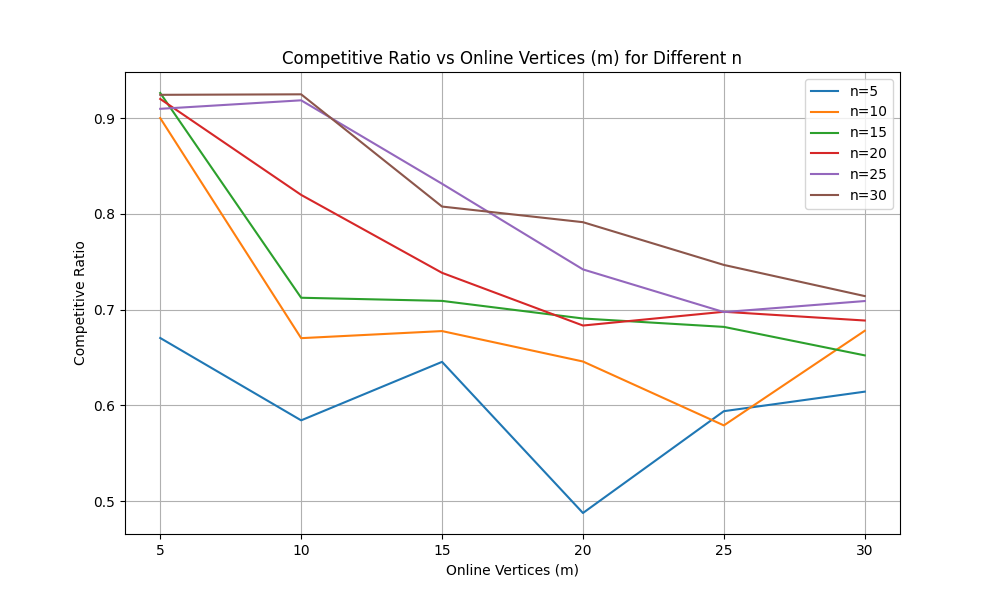
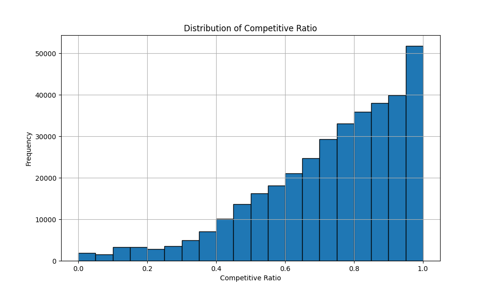
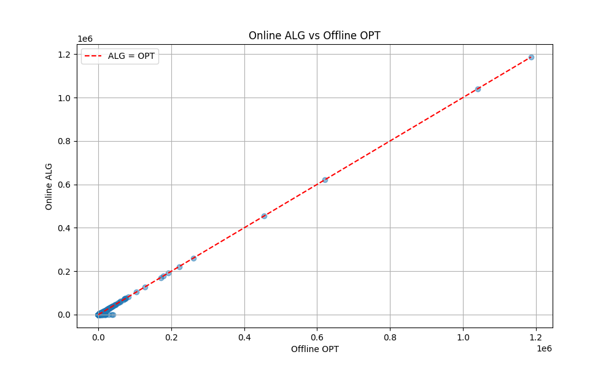
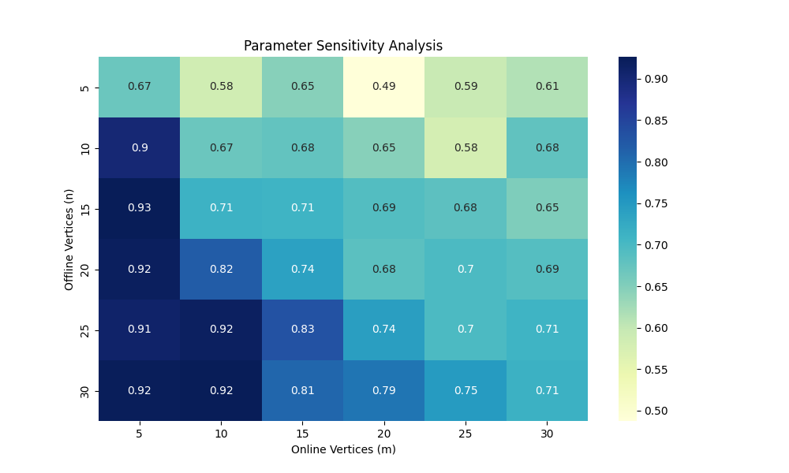

# Online Algorithm Notes++

## 0. Why Choose Numerical Experiments?

In the study and research of online algorithms, both theoretical analysis and numerical experiments are crucial approaches. While theoretical analysis helps us understand the performance bounds of algorithms, numerical experiments provide an intuitive verification of these theoretical results and reveal the algorithm's performance in practical problems. This note focuses on **numerical experiments** for the following reasons:

1. **Verifying Theoretical Results**: To validate whether the competitive ratio of the Prophet Matching algorithm approaches the theoretical value of 0.5.
2. **Exploring Parameter Impact**: To analyze how different parameters (such as $$n$$ and $$m$$) affect the algorithm's performance.
3. **Enhancing Intuitive Understanding**: To visually demonstrate the algorithm's behavior through charts and graphs.
4. **Providing a Foundation for Future Research**: The experimental results can offer data support for theoretical analysis or algorithm improvements.

Through numerical experiments, we gain a deeper understanding of the behavior of online algorithms and provide a reference for future research.

---

## 1. Experimental Objectives

The primary goal of this experiment is to validate whether the **Prophet Matching algorithm**'s competitive ratio approaches the theoretical value of 0.5 and to analyze its performance under various parameter settings. Specifically, we aim to:

- Test the impact of different numbers of offline vertices $$n$$ and online vertices $$m$$ on the competitive ratio.
- Analyze the relationship between the algorithm's gain $$ALG$$ and the offline maximum matching $$OPT$$.
- Explore parameter sensitivity to identify which parameters most significantly influence algorithm performance.

---

## 2. Experimental Setup

### 2.1 Parameter Settings

- **Number of offline vertices $$n$$**: 5, 10, 15, 20, 25, 30.
- **Number of online vertices $$m$$**: 5, 10, 15, 20, 25, 30.
- **Edge weight distribution**: Each edge's distribution type is randomly chosen (Uniform, Normal, Pareto, or Binomial).
- **Number of samples for calculating $$p_j$$ ($$num\_samples$$)**: 1000.
- **Number of trials for running the algorithm ($$num\_trials$$)**: 10000.
- **Directory for saving plots**: `plots`.

### 2.2 Data Generation

- The edge distribution type is randomly chosen, with the distribution parameters generated randomly:
  - **Uniform Distribution**: $$low \sim U(0, 0.5)$$, $$high \sim U(0.5, 1)$$.
  - **Normal Distribution**: $$\mu \sim U(0.5, 1)$$, $$\sigma \sim U(0.1, 0.3)$$.
  - **Pareto Distribution**: $$\alpha \sim U(1, 3)$$, $$scale \sim U(0.5, 1)$$.
  - **Binomial Distribution**: $$n \sim U(1, 10)$$, $$p \sim U(0, 1)$$.

### 2.3 Algorithm Implementation

- **Problem Instance Generation**:
  - Randomly generate the edge weight distributions for offline and online vertices.
- **Calculation of $$p_j$$**:
  - By sampling the edge weight distributions, compute the expected contribution $$OPT_j$$ for each offline vertex $$j$$.
  - Set $$p_j = 0.5 \cdot OPT_j$$.
- **Online Algorithm**:
  - For each online vertex arrival, choose the offline vertex that maximizes the utility $$v_{ij} - p_j$$ for matching.
  - If the maximum utility is less than 0, no matching occurs.
- **Offline Maximum Matching $$OPT$$**:
  - Use the Hungarian algorithm to calculate the offline maximum matching.

---

## 3. Experimental Results

### 3.1 Competitive Ratio Trend with Parameter Variations

- **Chart Description**:
  - X-axis: Number of online vertices $$m$$.
  - Y-axis: Average competitive ratio.
  - Multiple curves represent different numbers of offline vertices $$n$$.
- **Experimental Results**:
  - As $$m$$ increases, the competitive ratio gradually decreases.
  - The impact of $$n$$ on the competitive ratio is significant, with the competitive ratio slightly increasing as $$n$$ increases.
- **Chart**:
  

### 3.2 Competitive Ratio Distribution

- **Chart Description**:
  - X-axis: Competitive ratio.
  - Y-axis: Frequency.
- **Experimental Results**:
  - The frequency increases as the competitive ratio approaches 1.0.
  - This indicates that in most experiments, the algorithm’s competitive ratio exceeds the theoretical value of 0.5, with some experiments achieving competitive ratios close to 1.0, suggesting that the algorithm performs excellently in certain cases.
- **Chart**:
  

### 3.3 Algorithm Gain vs. Offline Maximum Matching

- **Chart Description**:
  - X-axis: Offline maximum matching $$OPT$$.
  - Y-axis: Online algorithm gain $$ALG$$.
  - The red dashed line represents $$ALG = OPT$$.
- **Experimental Results**:
  - $$ALG$$ is always less than or equal to $$OPT$$, as expected theoretically.
  - $$ALG$$ and $$OPT$$ exhibit a strong positive correlation.
- **Chart**:
  

### 3.4 Parameter Sensitivity Analysis

- **Chart Description**:
  - X-axis: Number of online vertices $$m$$.
  - Y-axis: Number of offline vertices $$n$$.
  - Color indicates the average competitive ratio.
- **Experimental Results**:
  - As the ratio of $$n$$ to $$m$$ increases, the competitive ratio increases.
  - Observing sensitivity to $$m$$ while fixing $$n$$, the larger the $$n$$, the less sensitive the algorithm is to $$m$$.
  - Observing sensitivity to $$n$$ while fixing $$m$$, the larger the $$m$$, the less sensitive the algorithm is to $$n$$.
- **Chart**:
  

---

## 4. Conclusion

Through this numerical experiment, we conducted a comprehensive validation and analysis of the Prophet Matching algorithm, leading to the following conclusions:

1. **Competitive Ratio Approaching the Theoretical Value**:
   - The experimental results show that the competitive ratio of the Prophet Matching algorithm is greater than the theoretical value of 0.5, confirming the algorithm's effectiveness.
   - $$ALG$$ is always less than or equal to $$OPT$$, as expected theoretically.
2. **Significant Impact of Parameters**:
   - The number of online vertices $$m$$ significantly affects the competitive ratio, with the ratio gradually approaching 0.5 as $$m$$ increases. This is because more online vertices increase the complexity of matching, making it harder for the algorithm to fully utilize all offline vertices, thereby reducing the competitive ratio.
   - The number of offline vertices $$n$$ has a smaller effect on the competitive ratio, but as $$n$$ increases, the competitive ratio slightly improves. This is because more offline vertices provide more matching options, allowing the algorithm to optimize the matches better, which improves the competitive ratio.
3. **Algorithm Robustness**:
   - The algorithm demonstrates some robustness to parameter variations.
   - By adjusting parameters (such as increasing $$m$$ or $$n$$), the algorithm's performance can be further improved.
4. **Limitations of the Experiment**:
   - The experiment only tested uniform, normal, Pareto, and binomial distributions, without covering all possible distribution types.
   - The experiment was conducted on a small scale and did not test larger problem instances.

### Value and Significance of the Experiment

- This experiment provides numerical verification of the theoretical results of the Prophet Matching algorithm and reveals the algorithm's performance in practical problems.
- The experimental results provide data support for further theoretical analysis and algorithm improvements.
- Through the experiments, we gained a deeper understanding of the behavior of online algorithms and provided a reference for future research.

---

## 5. Future Work

Building on the results of this experiment, future research could focus on the following areas:

1. **Support for More Distribution Types**:
   - Test more types of edge weight distributions (e.g., exponential, Poisson) and analyze the algorithm's performance across these distributions.
2. **Testing Larger-Scale Problem Instances**:
   - Increase the scale of both $$n$$ (offline vertices) and $$m$$ (online vertices) and analyze the algorithm's performance on larger problem instances.
3. **Improving Algorithm Efficiency**:
   - Improve the implementation of the algorithm to reduce runtime and enhance computational efficiency.
4. **Exploring More Complex Matching Scenarios**:
   - Investigate more complex matching problems (e.g., weighted matching, many-to-many matching) and analyze the algorithm's suitability and performance.

---

## 6. Appendix

### Code Implementation

You can find the code implementation in the github repository: [OnlineAlgorithmNotesDoublePlus](https://github.com/zsq259/OnlineAlgorithmNotesDoublePlus).

- **`main.py`**: The main program responsible for running experiments and calling other modules.
- **`algorithm.py`**: Implements the algorithm logic, including computing $$p_j$$, running the online algorithm, and calculating offline maximum matching.
- **`generate_problem.py`**: Generates problem instances, randomly selecting edge weight distributions.
- **`visualization.py`**: Responsible for plotting charts.
